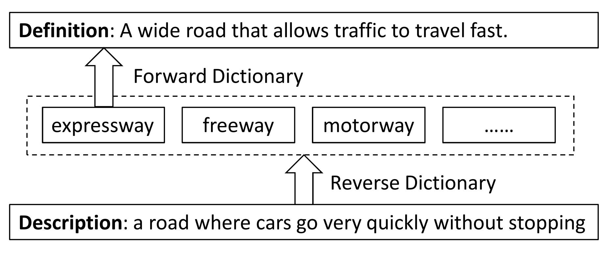

# MultiRD
Code and data of the AAAI-20 paper "Multi-channel Reverse Dictionary Model"

A reverse dictionary takes the description of a target word as input and outputs the target word together with other words that match the description. For example, a regular dictionary tells you that ``expressway'' is ``a wide road that allows traffic to travel fast'', and when you input ``a road where cars go very quickly without stopping'' to a reverse dictionary, it might return ``expressway'' together with other semantically similar words like ``freeway''.

